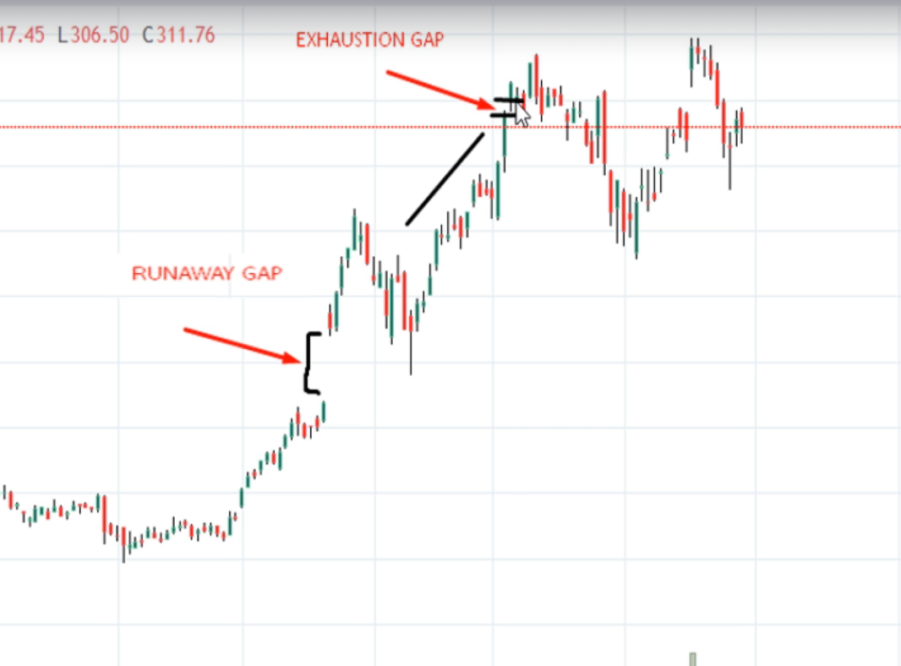

if demand increase supply : price go up
if demand decrease supply : price go down

peak = top
trough = bottom

uptrend = higher highes and higher lows
downtrend = lower highes and lower lows
sidetrend

major trend (1 year)
intermediate trend 
short trend

4 stages in stock market

    i. Accumalation 
    ii. Uptrend   
    i.Excess 
    ii. Exhaustion 
    iii. Distributional 
    iv. Downtrend

Trading Perspective

Intraday
Scalping - seconds to minutes

Positional
Intermediate - weeks to months
Swing trade - dyas to weeks 

Long therm - 1 year

from perpective to trend is different

A short sale is a sale of stock. The seller doesn't own
A trader borrows a secuirty to sell it. then later buys back the secuirty and returns it
If you have a short sell in equity segment. you have to square off your position before the day ends
If you want to hold your short sell trade for more than one day then, you have to trade in futures and options

Initial Margin
When we enter into a short sell trade we need to deposit a margin amount which is simply a percentage of the contract value

Maintenance Margin
It is the minimum amount that must be maintained at all times in the margin account

buy exit - buy low sell high
sell exit - buy

third point is the confirmation of the trend

New trend
Breakout

Log scale

lowest point when drawing a trend line

sharp down = momentum phase
We should ignore the momentum phase and starts from the next phase

An Uptrend line should be drawn below the prices and a Downtrend line should be drawn abovethe prices of the respective trend.

In logarithmic scale, the difference between two price points is spaced according to the percent change, rather than the absolute change

Types of support and resistance

Static
Dynamic

Moving Average =  Dynamic [ bull down :  bear up]

Rounding figure = Physcological support level

Rice channel = Dynamic support

Reversal Candles

Angle fit pattern - bearish

Heikin Ashi
(average pace)

False signals in candlesticks

Time Frames to be chosen

Intraday Trading
Positional Trading
Long Term 

Find 1 time frame above and below

Types of Indicators

Lagging 
Leading 

Moving Average
    - Are used in trending market
    - Tells us only trend not the top or bottom
    - Shouldn’t be used on their own
    - Are lagging indicator
    - Weekly charts

Exponential Moving average
    - Hourly charts
    

50 is above sell, buy likewise

MACD Moving Average Convergence / divergence 

when macd is 0 above = bul
when macd is 0 below = bear

RSI (Relative Strength Index)

Over bought and over sold levels
Overall trend direction
Early entry and exit Signals
Momentum

Osciliate between 0 to 100
important levels are 30, 40, 50, 60 , 70

30 = oversold
70 = overbought

Stochastic Osicliator

k line = moving average of D line
D line

when k line below D at 75 = selling signal

short time accurate, long time like day me wrong
either RSI or stochastic

Bolliger Bands

Indicate volatility
Tells about breakout
Continuation of trend
Achieve trend reversal signal

Upper band =  2 std up
Middle band  = 
Lower band = 2 std down

Head and shoulder pattern

True Leading Indicator (TLI)

It only gives buying signals
Works best on 15min and 1 hour chart
Always wait for trend line breakout for confirmation

Fibonacci (Retracements and extensions)

in up trend - bottom to up
in down trend - up to bottom 

Problems with fibanacci? which level is the ultimate level

combine with moving indicator - Moving average, bollinger average

Gap Theory

Typically next day starts

4 types of gaps

Common 
Breakaway
Runaway
Exhaustion

